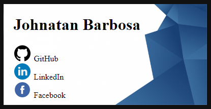

<h1 align="center"> Cartão de Visitas</h1>

  

### Sobre:

um simples cartão de visitas com minhas redes. Desafio do curso Programador Br

---

### Tacnologias ultilizadas:

- HTML5
- CSS3

---

### Autor:

 
<b>Johnatan Barbosa🚀</b>

Espero que goste, entre em contato!

